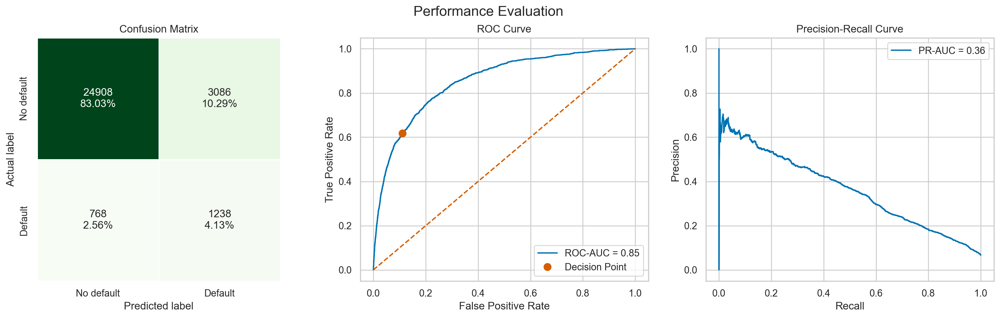

# Give-Me-Credit
Give Me Credit Kaggle Project
- $\textbf{Author}$: Patrick Mthisi
- $\textbf{Contact details}$: patrickmthisi@hotmail.com

## Give me credit project description and results:

The data used in this project can be found on Kaggle: https://www.kaggle.com/c/GiveMeSomeCredit/data

In this project, we used FastAI's TabularLearner to build a deep NN for credit classification. As the dataset is highly imbalanced, we employed two techniques to take into account this fact during modelling, and they are as follows:

- We employed oversampling for the minority class using simple random oversampling
- In addition, we also employed cost-sensitive learning into our TabularLearner model.

Due to the significant missingness in the data, we utilised KNN imputation instead of simpler techniques like mean or median imputation to maintain variability in the dataset.

Using FastAI's TabularLearner for this classification task—characterized by significant class imbalance—posed challenges compared to more established models like XGBoost or LightGBM, which are often easier to tune and interpret. However, the model performed well on the independent test set, achieving a recall of 0.62, ROC AUC of 0.85, PR AUC of 0.36, and Matthew’s correlation coefficient of 0.36. We selected an optimal classification threshold of 0.39 using Youden’s statistic to balance sensitivity and specificity. 

